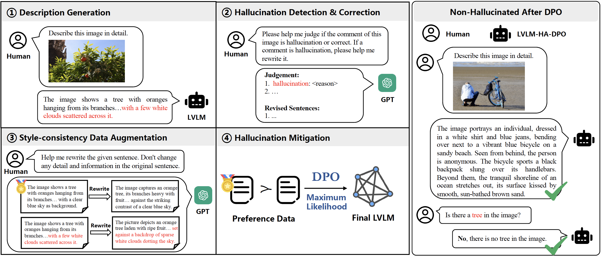

# HA-DPO (Hallucination-aware Direct Preference Optimization) <a href='https://arxiv.org/pdf/2311.16839.pdf'></a>

**Shanghai Artificial Intelligence Laboratory**

[[Paper]](https://arxiv.org/pdf/2311.16839.pdf) [[Data(huggingface)]](https://huggingface.co/datasets/juliozhao/hadpo-data) [[Data(opendatalab)]](https://openxlab.org.cn/datasets/zzy8782180/HA-DPO) [[Models]](https://huggingface.co/juliozhao)

## Introduction

We propose **HA-DPO** (Hallucination-aware Direct Preference Optimization), which eliminates LVLM hallucination using GPT-4 generated positive-negative data based on DPO (Direct Preference Optimization).

</a>

**This repo provides:**

- [x] High-quality positive-negative hallucination-aware data 

- [x] DPO framework for multiple LVLM (based on [TRL](https://github.com/huggingface/trl))

  - [x] MiniGPT-4
  - [x] LLaVA-1.5
  - [x] InstructBLIP

- [x] SHR Evaluation (Sentence-level Hallucination Ratio)

- [ ] Human-free positive-negative data mining pipeline

## Demo

Online demo will be available soon!

https://github.com/JulioZhao97/HA-DPO-video/assets/40555727/b35879ba-ab2a-4e9e-93d8-0e3b47e8a7e9

## Getting Started

1. create a new conda environment

```
conda create -n hadpo python==3.9
```

2. install requirements

```
conda activate hadpo
pip install -e .
```

## Data Preparation

For data preparation, please refer to [data preparation](ha_dpo/data/data_preparation.md).

## Model Training and Evaluation

For model training and evaluation, please refer to docs in following:

| MiniGPT-4 | LLaVA-1.5 | InstructBLIP |
| :--: | :--: | :--: |
| [doc](ha_dpo/models/minigpt4/README.md) | [doc](ha_dpo/models/llava-v1_5/README.md) | [doc](ha_dpo/models/instructblip/README.md) |

## SHR Evaluation

For SHR Evaluation, please refer to [SHR Evaluation](ha_dpo/shr_eval/README.md).

## Main Results

### MiniGPT-4-Llama2-7B

<details>
<summary> SHR results </summary>

| Model | HA-DPO | SHR |
|:--:|:--:|:--:|
| MiniGPT-4-Llama2-7B | :heavy_multiplication_x: | 47.3 |
| MiniGPT-4-Llama2-7B | :heavy_check_mark: | 44.4 |

</details>

<details>
<summary> POPE results </summary>

**POPE Random**

| Model | HA-DPO | Accuracy | Precision | Recall | F1 Score | Yes Ratio (%) |
|:--:|:--:|:--:|:--:|:--:|:--:|:--:|
| MiniGPT-4-Llama2-7B | :heavy_multiplication_x: | 51.13    | 50.57 | 99.80 | 67.13 | 98.66 |
| MiniGPT-4-Llama2-7B | :heavy_check_mark: | 86.13 | 92.81 | 78.33 | 84.96 | 42.20 |

**POPE Popular**

| Model | HA-DPO | Accuracy | Precision | Recall | F1 Score | Yes Ratio (%) |
|:--:|:--:|:--:|:--:|:--:|:--:|:--:|
| MiniGPT-4-Llama2-7B | :heavy_multiplication_x: | 51.46    | 50.74 | 99.53 | 67.72 | 98.06 |
| MiniGPT-4-Llama2-7B | :heavy_check_mark: | 79.50 | 80.20 | 78.33 | 79.25 | 48.83 |

**POPE Adversarial**

| Model | HA-DPO | Accuracy | Precision | Recall | F1 Score | Yes Ratio (%) |
|:--:|:--:|:--:|:--:|:--:|:--:|:--:|
| MiniGPT-4-Llama2-7B | :heavy_multiplication_x: | 51.26 | 50.64 | 99.66 | 67.16 | 98.40 |
| MiniGPT-4-Llama2-7B | :heavy_check_mark: | 75.66 | 74.36 | 78.33 | 76.29 | 52.66 |

</details>

### InstructBLIP-13B

<details>
<summary> SHR results </summary>

| Model | HA-DPO | SHR |
|:--:|:--:|:--:|
| InstructBLIP-13B | :heavy_multiplication_x: | 51.2 |
| InstructBLIP-13B | :heavy_check_mark: | 49.1 |

</details>

<details>
<summary> POPE results </summary>

**POPE Random**

| Model | HA-DPO | Accuracy | Precision | Recall | F1 Score | Yes Ratio (%) |
|:--:|:--:|:--:|:--:|:--:|:--:|:--:|
| InstructBLIP-13B | :heavy_multiplication_x: | 88.70 | 85.03 | 93.93 | 89.26 | 55.23 |
| InstructBLIP-13B | :heavy_check_mark: | 89.83 | 93.07 | 86.06 | 89.43 | 46.23 |

**POPE Popular**

| Model | HA-DPO | Accuracy | Precision | Recall | F1 Score | Yes Ratio (%) |
|:--:|:--:|:--:|:--:|:--:|:--:|:--:|
| InstructBLIP-13B | :heavy_multiplication_x: | 81.36 | 75.06 | 93.93 | 83.44 | 62.56 |
| InstructBLIP-13B | :heavy_check_mark: | 85.76 | 85.55 | 86.06 | 85.80 | 50.03 |

**POPE Adversarial**

| Model | HA-DPO | Accuracy | Precision | Recall | F1 Score | Yes Ratio (%) |
|:--:|:--:|:--:|:--:|:--:|:--:|:--:|
| InstructBLIP-13B | :heavy_multiplication_x: | 74.50 | 67.64 | 93.93 | 78.64 | 69.43 |
| InstructBLIP-13B | :heavy_check_mark: | 80.70 | 77.72 | 86.06 | 81.68 | 55.36 |

</details>

### LLaVA-1.5-7B

<details>
<summary> SHR results </summary>

| Model | HA-DPO | SHR |
|:--:|:--:|:--:|
| LLaVA-1.5 | :heavy_multiplication_x: | 36.7 |
| LLaVA-1.5 | :heavy_check_mark: | 34.0 |

</details>

<details>
<summary> POPE results </summary>

**POPE Random**

| Model | HA-DPO | Accuracy | Precision | Recall | F1 Score | Yes Ratio (%) |
|:--:|:--:|:--:|:--:|:--:|:--:|:--:|
| LLaVA-1.5 | :heavy_multiplication_x: | 89.60 | 88.77 | 90.66 | 89.70 | 51.06 |
| LLaVA-1.5 | :heavy_check_mark: | 90.53 | 92.99 | 87.66 | 90.25 | 47.13 |

**POPE Popular**

| Model | HA-DPO | Accuracy | Precision | Recall | F1 Score | Yes Ratio (%) |
|:--:|:--:|:--:|:--:|:--:|:--:|:--:|
| LLaVA-1.5 | :heavy_multiplication_x: | 86.20 | 83.23 | 90.66 | 86.79 | 54.46 |
| LLaVA-1.5 | :heavy_check_mark: | 87.90 | 88.07 | 87.66 | 87.81 | 49.76 |

**POPE Adversarial**

| Model | HA-DPO | Accuracy | Precision | Recall | F1 Score | Yes Ratio (%) |
|:--:|:--:|:--:|:--:|:--:|:--:|:--:|
| LLaVA-1.5 | :heavy_multiplication_x: | 79.76 | 74.43 | 90.66 | 81.75 | 60.90 |
| LLaVA-1.5 | :heavy_check_mark: | 81.46 | 77.99 | 87.66 | 82.54 | 56.20 |

</details>

## Acknowledgement

   - [MiniGPT-4](https://github.com/Vision-CAIR/MiniGPT-4). The MiniGPT-4 part of HA-DPO is based on the official MiniGPT-4 implementation. 
   - [VIGC](https://github.com/opendatalab/VIGC). The InstructBLIP part of HA-DPO is built on VIGC, which is an amazing visual instruction generation and correction method.
   - [LLaVA-1.5](https://github.com/haotian-liu/LLaVA). The LLaVA-v1.5 part of HA-DPO is based on the official LLaVA-1.5 implementation, which is a great open-source work on LVLM.
   - [TRL](https://github.com/huggingface/trl). Most model training and optimizing codes of HA-DPO are stemed from TRL, which is a great human-preference learning framework on LLM.


## Paper and Citing HA-DPO

You can find more details in our [paper](https://arxiv.org/pdf/2311.16839.pdf).

If you're using HA-DPO in your research or applications, please cite using this BibTeX:

```bibtex
@misc{zhao2023hallucinations,
      title={Beyond Hallucinations: Enhancing LVLMs through Hallucination-Aware Direct Preference Optimization}, 
      author={Zhiyuan Zhao and Bin Wang and Linke Ouyang and Xiaoyi Dong and Jiaqi Wang and Conghui He},
      year={2023},
      eprint={2311.16839},
      archivePrefix={arXiv},
      primaryClass={cs.CV}
}
```

## Contact us
If you have any questions, comments or suggestions, please do not hesitate to contact us at zhaozhiyuan@pjlab.org.cn and wangbin@pjlab.org.cn.

## License
[Apache License 2.0](LICENSE.txt)
