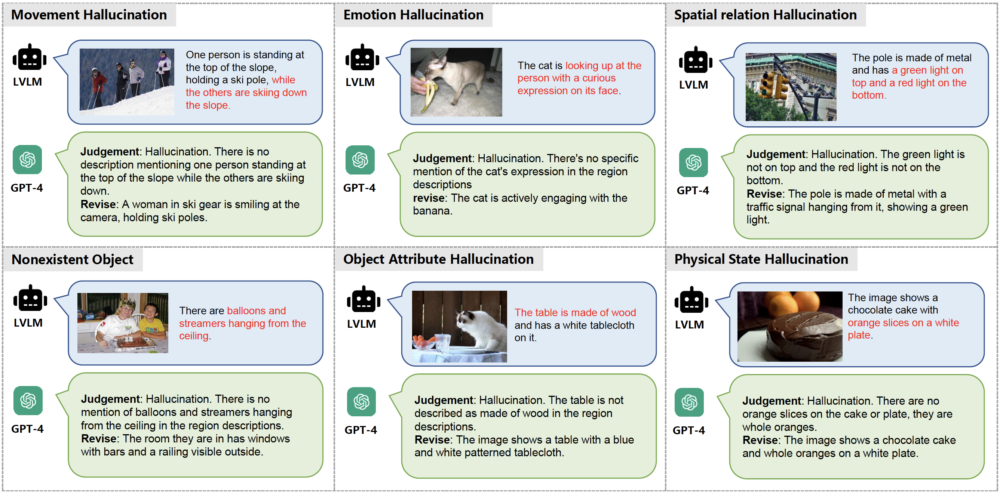

# SHR Evaluation (Sentence-level Hallucination Ratio)

## Introduction

SHR (Sentence-level Hallucination Ratio) is a **fine-grained, diverse, and accurate** evaluation benchmark of LVLM hallcuination on dense image descipription. 

SHR evaluation can be divided into 3 steps:

1. **Image Description**: LVLM is prompted to describe image in detail.

2. **GPT-4 evaluation**: GPT-4 classify each sentence of model response into _hallucination_ and _non-hallucination_.

3. **Metric Calculation**: The ratio of hallucinated sentences are calculated.

</a>

## Model Evaluation

To evaluate your own LVLM on SHR, you can follow these steps:

#### 1. Image Description

Prompt LVLM to describe validation images, validation images are stored in ```ha_dpo/data/shr/val_images_final.json```.

Default prompt we use is ```Describe this image in detail.``` and generation parameters we use are as follows (adjust these settings according to you needs):

| **temperature** | **do_sample** | **num_beams** |
|:--:|:--:|:--:|
| 1 | False | 5 |

#### 2. Response Preparation

Prepare model responses on validation images in following format:

```
{
    521: "This is an image of a house with a wooden siding and a green front door. There are several windows...",
    811: "The image shows a harbor with several boats docked...",
    ...
}
```

where key is the image_id and value is the corresponding model response.

#### 3. Evaluation

Run following command to evaluate on SHR:

```
python ha_dpo/shr_eval/json_eval.py \
--api-key {openai_apikey} \
--vg-path ha_dpo/data/VG \
--shr-path ha_dpo/data/shr \
--json-file {path_to_json}
```

1. ```openai_apikey```: the openai key. Begin with 'sk'
2. ```path_to_json```: the json file to the model responses.

After evaluation is finished, results are saved in ```ha_dpo/models/minigpt4/shr_eval_results/{localtime}/metrics.json```.

1. ```judgement.json```: detailed judgements in SHR evaluation.
2. ```metrics.json```: detailed metrics in SHR evaluation. ```mean_hal_ratio``` indicates the ration of hallucinated sentences, which is the main SHR result.